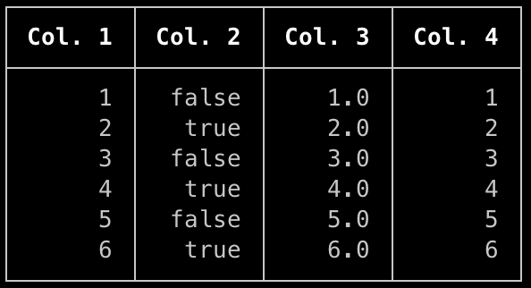
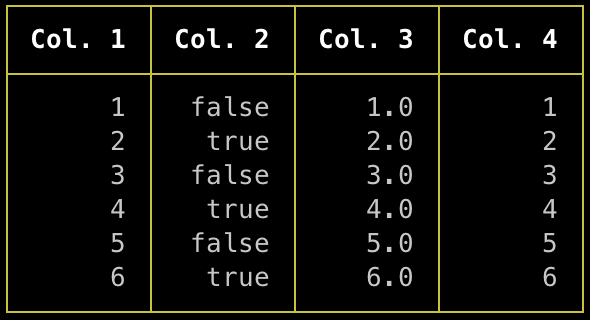
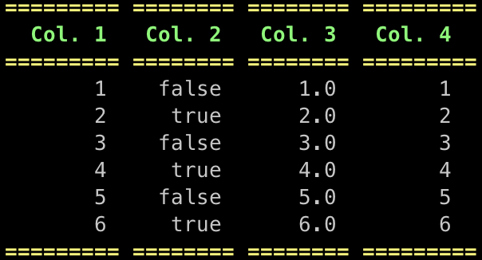
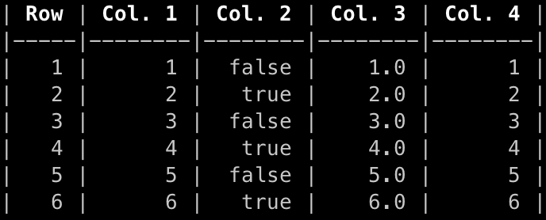
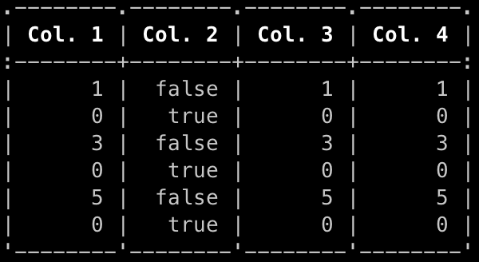
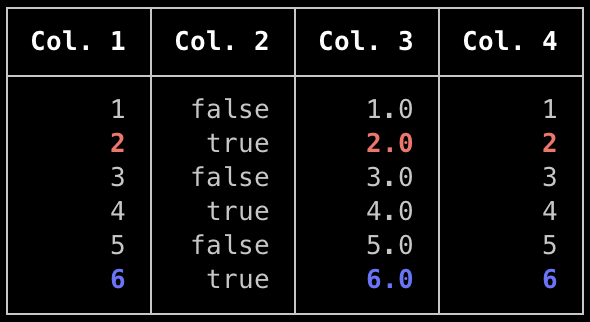
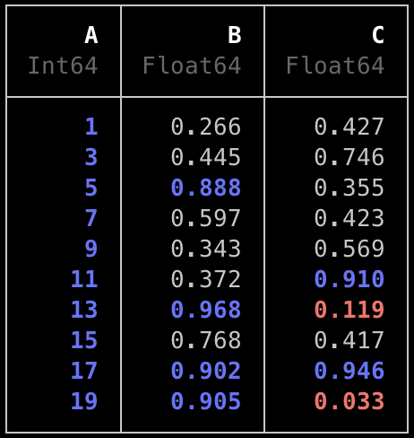
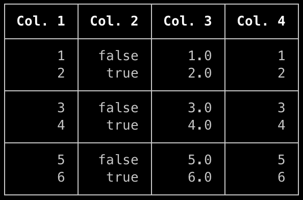
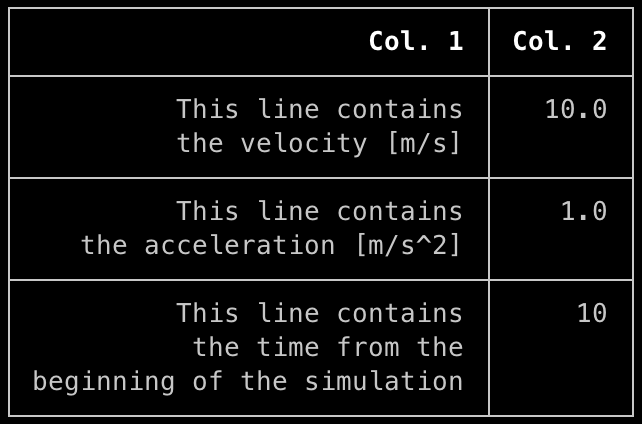
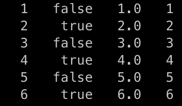

Examples
========

```@meta
CurrentModule = PrettyTables
DocTestSetup = quote
    using PrettyTables
end
```

In the following, it is presented how the following matrix can be printed using
this package:

```julia-repl
julia> data = Any[ 1    false      1.0     0x01 ;
                   2     true      2.0     0x02 ;
                   3    false      3.0     0x03 ;
                   4     true      4.0     0x04 ;
                   5    false      5.0     0x05 ;
                   6     true      6.0     0x06 ;]
```











The following example indicates how `highlighters` can be used to highlight the
lowest and highest element in the data considering the columns 1, 3, and 5:



Since this package has support to the API defined by
[Tables.jl](https://github.com/JuliaData/Tables.jl), then many formats, *e.g*
[DataFrames.jl](https://github.com/JuliaData/DataFrames.jl), can be pretty
printed:



You can use `hlines` keyword to divide the table into interesting parts:



If you want to break lines inside the cells, then you can set the keyword
`linebreaks` to `true`. Hence, the characters `\n` will cause a line break
inside the cell.



The keyword `noheader` can be used to suppres the header, which leads to a very
simplistic, compact format.



If you want to save the printed table to a file, you can do:

```julia-repl
julia> open("output.txt", "w") do f
            pretty_table(f,data)
       end
```
