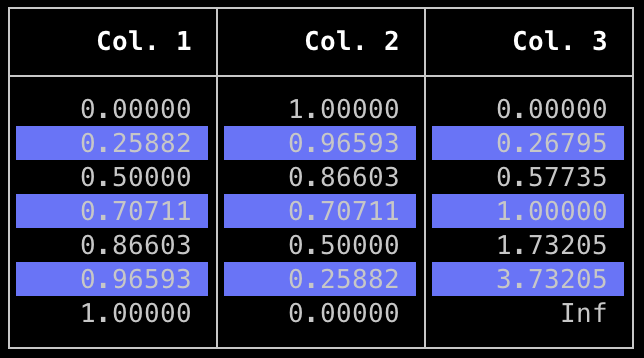

Highlighters
============

```@meta
CurrentModule = PrettyTables
DocTestSetup = quote
    using PrettyTables
end
```

The highlighters are special structure used to highlight fields in the printed
table. The definition depends on the back-end.

# Text highlighters

A highlighter of the text backend is an instance of the structure
[`TextHighlighter`](@ref) that contains information about which elements a
highlight style should be applied when using the text backend. The structure
contains three fields:

* `f`: Function with the signature `f(data,i,j)` in which should return `true`
       if the element `(i,j)` in `data` must be highlighted, or `false`
       otherwise.
* `crayon`: Crayon with the style of a highlighted element.

The function `f` must have the following signature:

    f(data, i, j)

in which `data` is a reference to the data that is being printed, `i` and `j`
are the element coordinates that are being tested. If this function returns
`true`, then the highlight style will be applied to the `(i,j)` element.
Otherwise, the default style will be used.

A set of highlighters can be passed as a `Tuple` to the `highlighter` keyword.
Notice that if multiple highlighters are valid for the element `(i,j)`, then the
applied style will be equal to the first match considering the order in the
Tuple `highlighters`.


If only a single highlighter is wanted, then it can be passed directly to the
keyword `highlighter` of `pretty_table` without being inside a `Tuple`.



!!! note

    If the highlighters are used together with [Formatter](@ref), then the
    change in the format **will not** affect that parameter `data` passed to the
    highlighter function `f`. It will always receive the original, unformatted
    value.

There are a set of pre-defined highlighters (with names `hl_*`) to make the
usage simpler. They are defined in the file
`./src/backends/text/predefined_highlighters.jl`.

To make the syntax less cumbersome, the following helper function is available:

```julia
function TextHighlighter(f; kwargs...)
```

It creates a `TextHighlighter` with the function `f` and pass all the keyword
arguments `kwargs` to the `Crayon`. Hence, the following code:

```julia-repl
julia> TextHighlighter((data,i,j)->isodd(i), Crayon(bold = true, background = :dark_gray))
```

can be replaced by:

```julia-repl
julia> TextHighlighter((data,i,j)->isodd(i); bold = true, background = :dark_gray)
```

# HTML highlighters

Coming soon...
